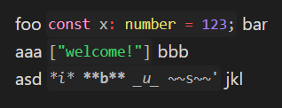

# Inline Code Highlight (Obsidian plugin)

Write `'<lang>` in inline code, and it'll render as such



```md
foo `'ts const x: number = 123;` bar
aaa `'json ["welcome!"]` bbb
asd `'md *i* **b** _u_ ~~s~~'` jkl
```

#### Note
Highlighting uses the builtin Prism.  
I don't know how to import it yet, so it'll work only after you've opened a page with a code block that Obsidian highlights itself 